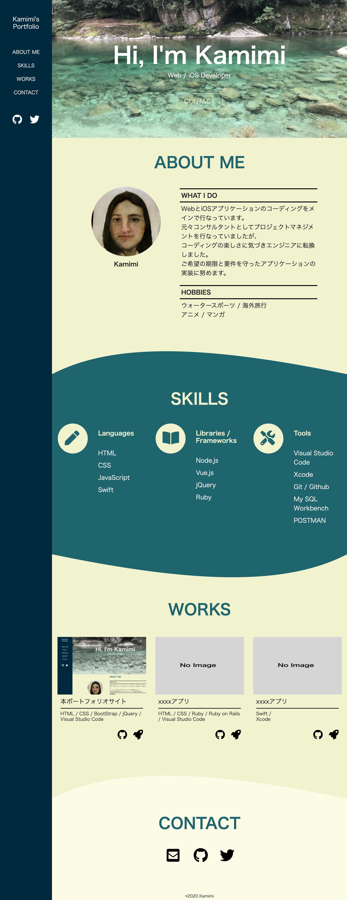

# kamimi-portfolio

## このサイトについて
* フロントエンドのみのポートフォリオサイト

## デモ(PC用表示のみ)

## 実装完了までの手順
1. デザイン検討 (実工数：約4時間)
  * 下記を参考に検討
    * デザイン入門教室(書籍)
    * Pinterestに掲載されているデザイン
    * 実際のエンジニア・デザイナーのポートフォリオ

2. モックアップ作成 (実工数：約4時間)
  * pptxで作成

3. コーディング (実工数：約17時間)

## 工夫したこと
* グローバルメニュを固定配置し、どのページにいてもすぐ別のコンテンツをみることができる
* レスポンシブ対応を行った
* コンテンツごとの切り口にsvgを用いて波線にした(参考：http://tympanus.net/codrops/2013/10/03/a-collection-of-separator-styles/)
* プロダクトのスクリーンショットの上にカーソルを当てると、別コンポーネントが現れる(参考：https://blog.raizzenet.com/mouse-hover-caption-effects-in-css/)
* コンタクトのメールアイコンを押下すると、メールアドレスをクリップボードにコピーすることができる
* メールアドレスをコピーすると、ツールチップを表示する(参考：https://www.jungleocean.com/programming/190308tooltip-css)

## 使用
### 言語
* HTML
* CSS
* JavaScript

### ライブラリ・フレームワーク
* Bootstrap
* jQuery
* Fontawesome

### ツール
* Visual Studio Code

### 改善できること
* htmlファイルとcssファイルが一つのみで、肥大化している
  * ejsを導入し、ファイルを分割する

### 今後導入してみたいこと
* Vue.js(導入済みだが未使用)
* このサイトから直接Kamimiに連絡できるようにフォームを作成すること(Googleフォーム導入したい)